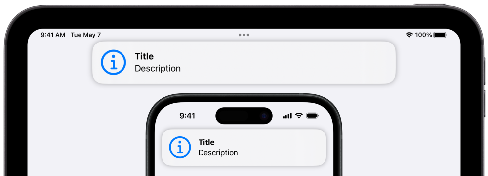

# Aquamarine - SwiftUI in-app notification manager


  

## About

**Aquamarine** allows you to create beautiful in-app notifications quickly and easily.
It works great on both iPhone and iPad and suports Dynamic Type.



## Installation

### Swift Package Manager

Go to `File -> Add Package Dependencies` in Xcode, then paste the [link](https://github.com/PinkXaciD/Aquamarine) to this repo.

## Usage

### Overview

Import Aquamarine into your application.

```swift
import Aquamarine
```

Then add the `aquamarineNotifications()` modifier to your root view.

```swift
YourView {
    // View content
}
.aquamarineNotifications()
```

> ### Note
> Currently does not work over sheets or full screen covers from the root view.

### Stores

You need to pass a notification store, which manages the creation and deletion of notifications, to the view modifier. By default the  overlay will use `AQNotificationStore.standard`. You can then call `addNotification()` and `removeNotification()` methods of the store to manage notifications.

```swift
AQNotificationStore.standard.addNotification(notification)

AQNotificationStore.standard.removeNotification(notification.id)
```

Alternatively, you can create your own store and customize it's parameters, like notification closing delay.

```swift
@StateObject var customStore = AQNotificationStore(closeDelay: 5)

YourView {
    // View content
}
.aquamarineNotifications(store: customStore)
```

### Notifications

When you want to show a notification to the user you need to call `AQNotificationStore.standard.addNotification()` (assuming you are using the standard store) and pass notification data of type `AQNotificationData` to it.

In `AQNotificationData` you need to specify the title and type of the notification. You can also provide additional parameters like a custom or system image, description and tap action closure.

```swift
let notification = AQNotificationData(.info, "Title", description: "Description", systemImage: "info.circle") {
    // Your action in trailing closure syntax
}
```

### Notification Types

`AQNotificationData` accepts an `AQNotificationType` object. The object contains a system image tint and haptic feedback.

There are 4 built-in types:

- `info` - no tint, no haptic notification
- `success` -  green tint, system "success" haptic notification
- `warning` - yellow tint, system "warning" haptic notification
- `error` - red tint, system "error" haptic notification

You can also create your own notification types:

```swift
let notificationType = AQNotificationData.AQNotificationType(iconColor: .purple, haptic: .success)
```

If notification type color is set to `nil` Aquamarine will use the app's tint color for system icons. If haptic is set to `nil` no haptic feedback will be played.


*This code is available under the MIT license. [Learn more.](../LICENSE)*
